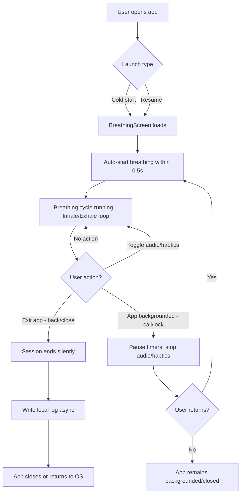

# Feature Spec – Made by Anxiety : Breathe Right Now

---

## 서비스 흐름도

```mermaid
flowchart TD
    A[User opens app] --> B{Launch type}
    B -->|Cold start| C[BreathingScreen loads]
    B -->|Resume| C[BreathingScreen loads]

    C --> D[Auto-start breathing within 0.5s]
    D --> E[Breathing cycle running - Inhale/Exhale loop]

    E --> F{User action?}
    F -->|No action| E
    F -->|Toggle audio/haptics| E
    F -->|Exit app - back/close| G[Session ends silently]
    F -->|App backgrounded - call/lock| H[Pause timers, stop audio/haptics]

    H --> I{User returns?}
    I -->|Yes| D
    I -->|No| J[App remains backgrounded/closed]

    G --> K[Write local log async]
    K --> L[App closes or returns to OS]
```
